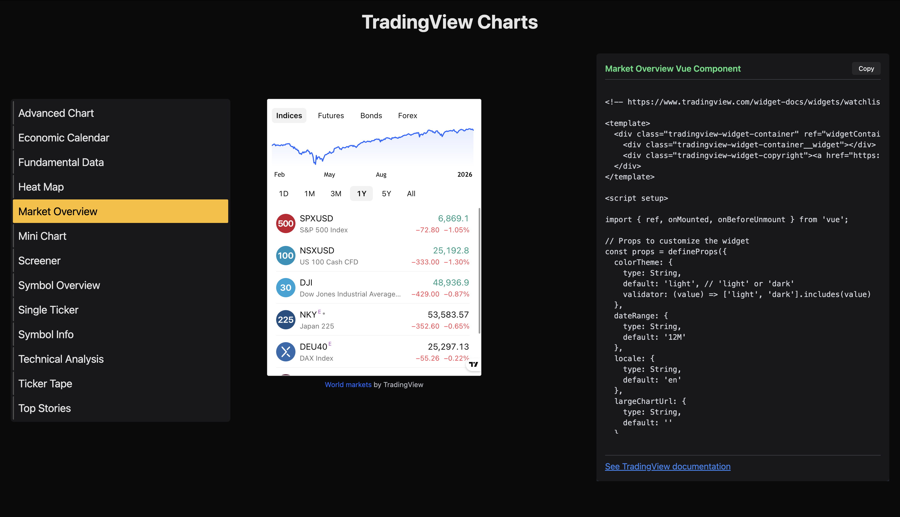
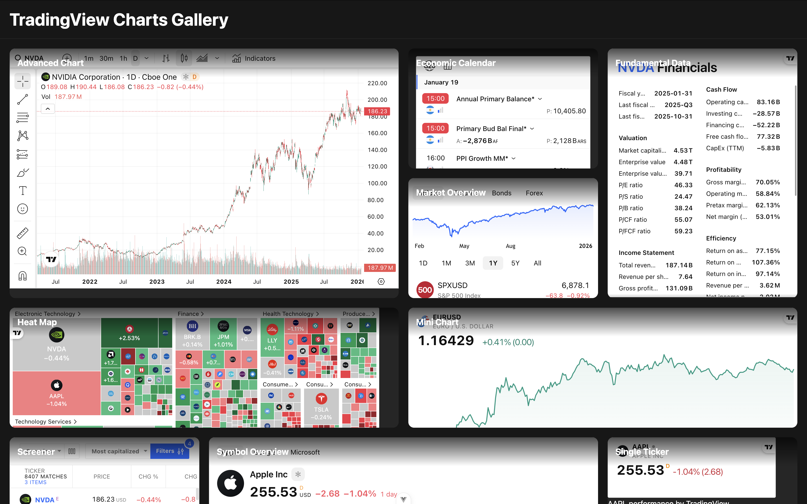
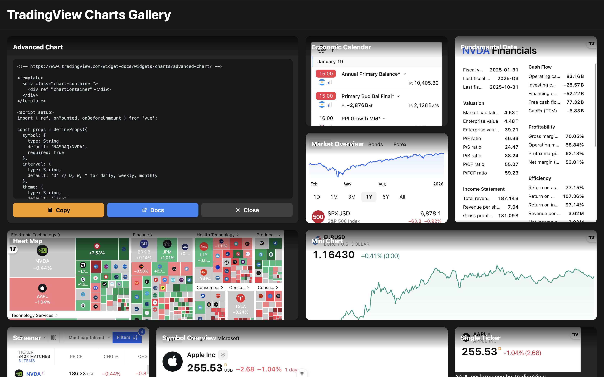

# TradingView Vue Chart Components

A collection of TradingView widget integrations for Vue 3, providing financial chart components with live market data.








## 📋 Overview

This project offers a suite of TradingView widgets wrapped as reusable Vue 3 components. It includes an interactive showcase where you can preview each widget, view its source code, and copy it for your own projects. 

## ✨ Features

- 🖼️ **Charts gallery** - Page to visualize all charts at once
- 🎨 **13 TradingView Widgets** - Complete collection of financial chart and data widgets
- 🔍 **Interactive Preview** - Live component showcase with real-time data
- 📝 **Source Code Viewer** - View and copy component code directly
- 🎯 **Vue 3 + Composition API** - Modern Vue.js implementation

## 🚀 Quick Start

### Prerequisites

- Node.js (v16 or higher)
- npm or yarn

### Installation

```bash
# Clone the repository
git clone https://github.com/localhost-5555/TradingView-Vue-Chart-Components.git
cd TradingViewVueChartComponents

# Install dependencies
npm install

# Start development server
npm run dev

# Build for production
npm run build
```

## 📦 Available Components

### Charts
- **AdvancedChart** - Full-featured interactive trading chart
- **MiniChart** - Compact chart widget for quick overview
- **SymbolOverview** - Chart with symbol information panel

### Market Data
- **MarketOverview** - Multi-market watchlist with key indices
- **Screener** - Stock/crypto screener with filtering
- **HeatMap** - Visual market performance heatmap

### Tickers & Info
- **TickerTape** - Scrolling ticker tape with live prices
- **SingleTicker** - Individual symbol ticker
- **SymbolInfo** - Detailed symbol information panel

### Analysis
- **TechnicalAnalysis** - Technical indicators and signals
- **FundamentalData** - Financial metrics and fundamentals

### News & Events
- **EconomicCalendar** - Economic events calendar
- **TopStories** - Latest market news and stories

## 🎯 Usage

### Basic Component Usage

```vue
<script setup>
import AdvancedChart from '@/components/TradingView/AdvancedChart.vue'
</script>

<template>
  <AdvancedChart 
    symbol="NASDAQ:AAPL"
    interval="D"
    theme="dark"
  />
</template>
```

### Using the Showcase

1. Navigate to the home page
2. Select a component from the left sidebar
3. Preview the component in the center panel
4. View source code in the right panel
5. Click "Copy" to copy the component code
6. Click the documentation link to view TradingView's official docs

## 📂 Project Structure

```
TradingViewVueChartComponents/
├── src/
│   ├── components/
│   │   └── TradingView/          # All TradingView widget components
│   │       ├── AdvancedChart.vue
│   │       ├── EconomicCalendar.vue
│   │       ├── FundamentalData.vue
│   │       ├── HeatMap.vue
│   │       ├── MarketOverview.vue
│   │       ├── MiniChart.vue
│   │       ├── Screener.vue
│   │       ├── SingleTicker.vue
│   │       ├── SymbolInfo.vue
│   │       ├── SymbolOverview.vue
│   │       ├── TechnicalAnalysis.vue
│   │       ├── TickerTape.vue
│   │       ├── TopStories.vue
│   │       └── TradingViewDocs.md
│   ├── views/
│   │   └── Home.vue               # Interactive showcase
│   ├── router/
│   │   └── index.js
│   ├── App.vue
│   └── main.js
├── public/
├── index.html
├── package.json
└── vite.config.js
```

## ⚠️ Known Limitations

- Changing the default values for symbol has to be done manually in the source code
- Components are functional but may need polish for production use
- Some widgets load external scripts dynamically (may need optimization)
- Error handling is basic in most components
- Limited prop reactivity in some components

## 📚 Resources

- [TradingView Widget Documentation](https://www.tradingview.com/widget-docs/)
- [Vue 3 Documentation](https://vuejs.org/)
- [Vite Documentation](https://vitejs.dev/)

**Note:** This is a demonstration/educational project. For production use, ensure compliance with TradingView's [Terms of Use](https://www.tradingview.com/policies/) and widget usage guidelines.